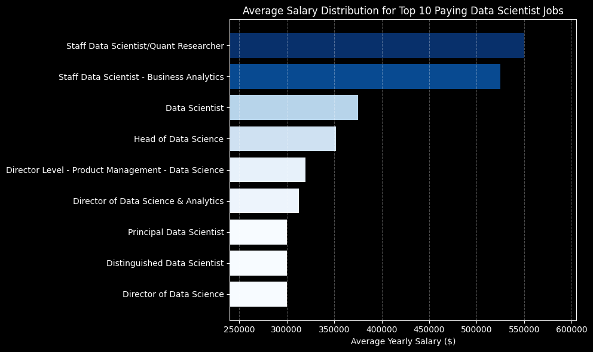
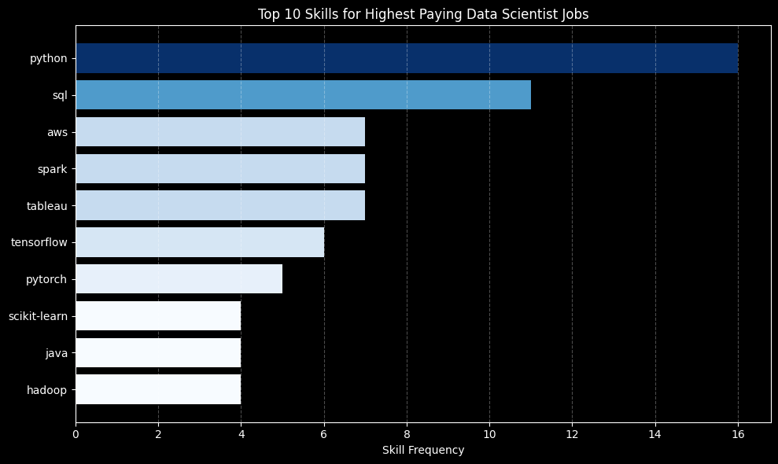

# Introduction

This project analyzes job postings data to identify the most valuable skills for Data Scientist roles. The focus is on understanding which skills are associated with high salaries, strong demand, and overall career growth.

Using SQL, I explored a dataset of job postings to uncover insights into top-paying roles, in-demand skills, and the optimal skills that offer a balance of high demand and high pay.

Check out my SQL queries here - [Project_SQL Folder](/Project_SQL/)

## Key Highlights

- Identified top-paying Data Scientist roles with salaries up to $650K  
- Analyzed the relationship between skill demand and salary across 25+ skills  
- Discovered high-value skills that balance demand and compensation  
- Built advanced SQL queries using joins, aggregations, and CTEs  

# Background

With the growing demand for data science roles, it can be challenging to identify which skills to focus on for career growth. This project was created to better understand which skills are most valuable by analyzing real-world job postings.

The dataset used in this project comes from Luke Barousse’s [SQL Course](https://lukebarousse.com/sql) and includes information on job titles, salaries, locations, and required skills. By focusing specifically on Data Scientist roles, this analysis aims to provide clearer direction on which skills are most in demand, which are associated with higher salaries, and how to prioritize learning effectively.

### The questions I wanted to answer through my SQL queries were:

1. What are the top-paying Data Scientist jobs?
2. What skills are required for these top-paying jobs?
3. What skills are most in demand for Data Scientists?
4. Which skills are associated with higher salaries?
5. What are the most optimal skills to learn?

# Tools I Used

For this analysis, I used the following tools to query, manage, and explore the data:

- **SQL (PostgreSQL):** Used to write queries, perform joins, and analyze job posting data to extract meaningful insights.

- **PostgreSQL:** The database system used to store and manage the dataset efficiently.

- **Visual Studio Code (SQLTools):** Used to write and execute SQL queries and manage database connections.

- **Git & GitHub:** Used for version control and to organize and share the project files.

# The Analysis

Each query in this project focuses on analyzing different aspects of the Data Scientist job market. The goal is to understand how skills relate to salary, demand, and overall career value.

Here’s how I approached each question:

### 1. Top Paying Data Scientist Jobs

To identify the highest-paying roles, I filtered Data Scientist positions based on average yearly salary and focused on remote roles with specified salaries.

This analysis highlights the top-paying opportunities in the field and provides insight into the types of roles that offer the highest compensation.

```sql
SELECT
    job_id,
    job_title,
    job_location,
    job_schedule_type,
    salary_year_avg,
    job_posted_date,
    name AS company_name
FROM
    job_postings_fact
LEFT JOIN company_dim ON job_postings_fact.company_id = company_dim.company_id
WHERE
    job_title_short = 'Data Scientist' AND
    job_location = 'Anywhere' AND
    salary_year_avg IS NOT NULL
ORDER BY
    salary_year_avg DESC
LIMIT 25
```

- **Wide Salary Range:** Top-paying roles span from approximately $184,000 to $650,000, highlighting the massive earning potential at senior and leadership levels within data science.  

- **Leadership Roles Drive Top Salaries:** Positions such as *Head of Data Science, Director,* and *Principal Data Scientist* dominate the highest salary brackets, indicating that strategic and managerial responsibilities significantly boost compensation.  

- **Strong Presence of Specialized Roles:** High-paying titles like *Quant Researcher* and advanced AI-focused roles suggest that deep domain expertise and specialization play a key role in reaching top salary levels.    



*Bar chart visualizing the salary distribution for the top 10 highest-paying Data Scientist roles, derived from the SQL query results.*

### 2. Skills for Top Paying Data Scientist Jobs

To identify the skills required for the highest-paying data scientist roles, I joined job postings with the skills dataset. This approach highlights the key tools and technologies associated with top salaries, providing insight into what employers prioritize in high-compensation positions.

```sql
WITH top_paying_jobs AS (
    SELECT
        job_id,
        job_title,
        salary_year_avg,
        name AS company_name
    FROM
        job_postings_fact
    LEFT JOIN company_dim ON job_postings_fact.company_id = company_dim.company_id
    WHERE
        job_title_short = 'Data Scientist' AND
        job_location = 'Anywhere' AND
        salary_year_avg IS NOT NULL
    ORDER BY
        salary_year_avg DESC
    LIMIT 25
)
SELECT
    top_paying_jobs.*,
    skills_dim.skills
FROM top_paying_jobs
INNER JOIN skills_job_dim ON top_paying_jobs.job_id = skills_job_dim.job_id
INNER JOIN skills_dim ON skills_job_dim.skill_id = skills_dim.skill_id
ORDER BY
    salary_year_avg DESC
```

- **Python Dominates the Landscape:** Python appears most frequently, with 16 mentions, reinforcing its role as the core programming language for high-paying data science positions.  

- **SQL Remains Essential:** With 11 occurrences, SQL continues to be a critical skill for data handling, querying, and working with large datasets.  

- **Big Data & Visualization Tools Add Strong Value:** Technologies like *Spark, AWS,* and *Tableau* (7 mentions each) highlight the importance of handling large-scale data and effectively communicating insights.  

- **Machine Learning Expertise is Highly Valued:** Tools such as *TensorFlow* (6 mentions) and *PyTorch* (5 mentions) indicate strong demand for deep learning and advanced modeling capabilities.  

- **Supporting Technical Skills Enhance Profiles:** Skills like *Hadoop, Java,* and *Scikit-learn* (4 mentions each) show that a well-rounded technical stack contributes to higher-paying opportunities.



*Bar chart visualizing the most frequently required skills across the top-paying Data Scientist roles, derived from the SQL query results.*

### 3. In-Demand Skills for Data Scientists

This query highlights the skills most frequently requested in job postings, focusing on the tools with the highest demand in the job market.

```sql
SELECT
    skills,
    COUNT (skills_job_dim.job_id) AS demand_count 
FROM job_postings_fact
INNER JOIN skills_job_dim ON job_postings_fact.job_id = skills_job_dim.job_id
INNER JOIN skills_dim ON skills_job_dim.skill_id = skills_dim.skill_id
WHERE
    job_title_short = 'Data Scientist' AND
    job_work_from_home = TRUE
GROUP BY
    skills
ORDER BY
    demand_count DESC
LIMIT 5
```

### Most In-Demand Skills for Data Scientists

- **Python and SQL clearly dominate demand**, with significantly higher counts than all other skills, making them essential for any data science role.  
- **A noticeable drop after the top 3 skills (Python, SQL, R)** suggests that while many tools are useful, core programming languages remain the primary requirement.

| Rank | Skill   | Demand Count |
|------|--------|-------------|
| 1    | Python | 10,390      |
| 2    | SQL    | 7,488       |
| 3    | R      | 4,674       |
| 4    | AWS    | 2,593       |
| 5    | Tableau| 2,458       |

*Table highlighting the top 5 skills in highest demand for Data Scientists.*

### 4. Skills Based on Salary

This query examines the average salary associated with each skill, identifying the skills that command the highest pay in Data Science roles.

```sql
SELECT
    skills,
    ROUND (AVG (salary_year_avg),0) AS avg_salary
FROM job_postings_fact
INNER JOIN skills_job_dim ON job_postings_fact.job_id = skills_job_dim.job_id
INNER JOIN skills_dim ON skills_job_dim.skill_id = skills_dim.skill_id
WHERE
    job_title_short = 'Data Scientist' AND
    salary_year_avg IS NOT NULL AND
    job_work_from_home = TRUE
GROUP BY
    skills
ORDER BY
    avg_salary DESC
LIMIT 25
```
- **Specialized & Niche Expertise Drives Top Salaries:**  
  Skills like *GDPR*, *Golang*, and *Solidity* show that domain-specific and less common expertise commands the highest pay, as companies are willing to pay a premium for rare, high-impact capabilities.

- **Strong Overlap Between Data Science and Engineering:**  
  Tools such as *Go*, *Rust*, *Airflow*, *Redis*, and *Cassandra* highlight that top-paying roles go beyond analysis, requiring the ability to build and maintain scalable data systems.

- **Broad Technical Versatility Across the Data Stack:**  
  The mix of BI tools (*Looker*, *Qlik*), databases (*DynamoDB*, *Neo4j*), programming languages, and AI platforms indicates that high-paying roles demand end-to-end proficiency across the data ecosystem rather than a single specialization.

| Rank | Skill          | Avg Salary ($) |
|------|---------------|----------------|
| 1    | GDPR          | 217,738        |
| 2    | Golang        | 208,750        |
| 3    | Atlassian     | 189,700        |
| 4    | Selenium      | 180,000        |
| 5    | OpenCV        | 172,500        |
| 6    | Neo4j         | 171,655        |
| 7    | MicroStrategy | 171,147        |
| 8    | DynamoDB      | 169,670        |
| 9    | PHP           | 168,125        |
| 10   | Tidyverse     | 165,513        |

*Table for the top 10 skills with the highest average salaries across Data Scientist roles.*

### 5. Most Optimal Skills to Learn

This query combines insights from both demand and salary data to identify skills that are not only highly sought after but also offer strong earning potential, helping prioritize impactful skill development.

```sql
SELECT
    skills_dim.skill_id,
    skills_dim.skills,
    COUNT(skills_job_dim.job_id) AS demand_count,
    ROUND(AVG(job_postings_fact.salary_year_avg), 0) AS avg_salary
FROM job_postings_fact
INNER JOIN skills_job_dim 
    ON job_postings_fact.job_id = skills_job_dim.job_id
INNER JOIN skills_dim 
    ON skills_job_dim.skill_id = skills_dim.skill_id
WHERE
    job_title_short = 'Data Scientist'
    AND salary_year_avg IS NOT NULL
    AND job_work_from_home = TRUE
GROUP BY
    skills_dim.skill_id
HAVING
    COUNT(skills_job_dim.job_id) > 10
ORDER BY
    avg_salary DESC,
    demand_count DESC
LIMIT 25;
```

| Rank | Skill      | Demand Count | Avg Salary ($) |
|------|-----------|--------------|----------------|
| 1    | C         | 48           | 164,865        |
| 2    | Go        | 57           | 164,691        |
| 3    | Qlik      | 15           | 164,485        |
| 4    | Looker    | 57           | 158,715        |
| 5    | Airflow   | 23           | 157,414        |
| 6    | BigQuery  | 36           | 157,142        |
| 7    | Scala     | 56           | 156,702        |
| 8    | GCP       | 59           | 155,811        |
| 9    | Snowflake | 72           | 152,687        |
| 10   | PyTorch   | 115          | 152,603        |

*Table of the most optimal skills for Data Scientists sorted by salary*

- **Engineering-Oriented Skills Command Strong Pay with Solid Demand:**  
  Skills like *Go* and *C* offer some of the highest salaries (around $164K–$165K) while still maintaining moderate demand (~50+ postings), highlighting the premium on roles that blend data science with software engineering.

- **Cloud & Data Infrastructure Skills Are Consistently Valuable:**  
  Tools such as *GCP*, *BigQuery*, and *Snowflake* combine strong demand (ranging from ~36 to 72 postings) with high average salaries (~$152K–$157K), reflecting the growing importance of cloud-based data ecosystems.

- **Niche Tools Deliver High Pay Despite Lower Demand:**  
  Specialized tools like *Qlik* stand out with top-tier salaries (~$164K) but relatively low demand (15 postings), suggesting that rare expertise can still command a premium in targeted roles.

# What I Learned

Throughout this project, I strengthened both my SQL skills and my ability to think analytically about real-world data:

- **Advanced SQL Techniques:**  
  Gained hands-on experience with joins, CTEs, and aggregations to transform raw job posting data into meaningful insights.

- **Data-Driven Thinking:**  
  Learned how to break down broad questions into structured queries, helping uncover trends in salaries, demand, and skill value.

- **Balancing Trade-offs in Data:**  
  Understood that the most valuable skills are not just high-paying or in-demand, but those that strike a balance between both.

- **From Data to Insights:**  
  Improved my ability to interpret query results and translate them into clear, actionable insights rather than just outputs.

- **End-to-End Project Workflow:**  
  Experienced the full cycle from data exploration and querying to visualization and documenting findings in a structured way.

# Conclusions

### Insights

- **High Salaries Are Closely Tied to Specialization and Responsibility:**  
  The highest-paying roles are often senior or specialized positions, indicating that deep expertise and leadership responsibilities significantly boost earning potential.

- **Core Skills Remain Foundational but Highly Competitive:**  
  Skills like *Python* and *SQL* consistently show strong demand, reinforcing their importance, but their widespread adoption means they are essential rather than differentiating.

- **Engineering and Data Infrastructure Skills Drive Higher Pay:**  
  Skills related to data engineering and system design (e.g., *Airflow*, *Spark*, *Cloud platforms*) are strongly associated with higher salaries, highlighting the growing overlap between data science and engineering.

- **Cloud and Big Data Technologies Are Increasingly Valuable:**  
  Tools such as *AWS*, *GCP*, *Snowflake*, and *BigQuery* appear frequently across both demand and salary analyses, underscoring the industry shift toward cloud-based data ecosystems.

- **The Most Optimal Skills Combine Demand with High Salary Potential:**  
  Skills like *Go*, *Scala*, *GCP*, and *BigQuery* stand out for balancing strong demand with high salaries, making them particularly valuable for long-term career growth.

### Closing Thoughts

This project strengthened my SQL skills while providing practical insights into the data science job market. By analyzing salary trends, skill demand, and their intersection, I was able to identify what truly drives value in real-world roles.

The findings highlight that success in this field goes beyond mastering core tools — it requires building a well-rounded skill set that combines technical depth, data engineering capabilities, and adaptability to evolving technologies.

Overall, this project reinforced the importance of continuous learning and strategic skill development, helping me better understand how to navigate and grow within the data science landscape.

*Ultimately, the most valuable skills are those that evolve with the industry — and so must the people who build them.*

